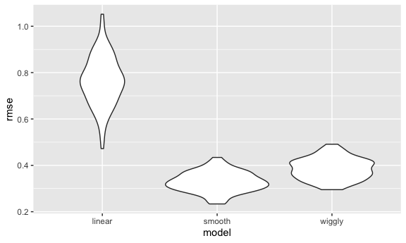
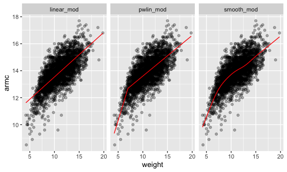
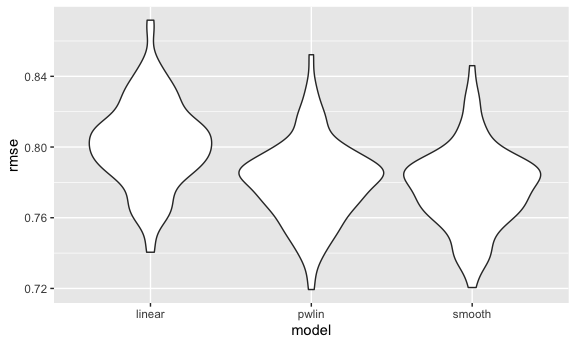

Cross validation
================
AnMei Chen
11/16/2021

``` r
library(tidyverse)
```

    ## ── Attaching packages ─────────────────────────────────────── tidyverse 1.3.1 ──

    ## ✓ ggplot2 3.3.5     ✓ purrr   0.3.4
    ## ✓ tibble  3.1.5     ✓ dplyr   1.0.7
    ## ✓ tidyr   1.1.3     ✓ stringr 1.4.0
    ## ✓ readr   2.0.1     ✓ forcats 0.5.1

    ## ── Conflicts ────────────────────────────────────────── tidyverse_conflicts() ──
    ## x dplyr::filter() masks stats::filter()
    ## x dplyr::lag()    masks stats::lag()

``` r
library(modelr)
library(mgcv)
```

    ## Loading required package: nlme

    ## 
    ## Attaching package: 'nlme'

    ## The following object is masked from 'package:dplyr':
    ## 
    ##     collapse

    ## This is mgcv 1.8-38. For overview type 'help("mgcv-package")'.

``` r
knitr::opts_chunk$set(
  fig.width = 6,
  fig.asp = .6,
  out.width = "90%"
)

options(
  ggplot2.continuous.colour = "viridis" , 
  ggplot2.continuous.fill = "viridis"
)

scale_colour_discrete = scale_colour_viridis_d
scale_fill_discrete = scale_fill_viridis_d
```

## simulate data

``` r
nonlin_df = 
  tibble(
    id = 1:100,
    x = runif(100, 0, 1),
    y = 1 - 10 * (x - .3) ^ 2 + rnorm(100, 0, .3)
  )
```

look at the data

``` r
nonlin_df %>% 
  ggplot(aes(x = x , y = y)) +
  geom_point()
```


## cross validation – by hand

get training and testing datasets

training df sampled 80 of samples from the nonlin\_df. testing df gets
20 samples from the nonlin\_df that is not included in the train\_df

``` r
train_df = sample_n(nonlin_df, size = 80)
test_df = anti_join(nonlin_df, train_df, by = "id")
```

Fit three models.

``` r
linear_mod = lm(y ~ x, data = train_df)
smooth_mod = gam( y ~ s(x), data = train_df)
wiggly_mod = gam( y ~ s(x, k = 30), sp = 10e-6, data = train_df)
```

can I see what I just did…

``` r
train_df %>% 
  add_predictions(linear_mod) %>% 
  ggplot(aes(x = x, y = y)) +
  geom_point() + 
  geom_line(aes( y = pred), color = "red")
```


``` r
train_df %>% 
  add_predictions(smooth_mod) %>% 
  ggplot(aes(x = x, y = y)) +
  geom_point() + 
  geom_line(aes( y = pred), color = "red")
```


``` r
train_df %>% 
  add_predictions(wiggly_mod) %>% 
  ggplot(aes(x = x, y = y)) +
  geom_point() + 
  geom_line(aes( y = pred), color = "red")
```


smooth model is the best in terms of accuracy.

use gather\_predictions() and facet\_grid to compare models
simultaneously

``` r
train_df %>% 
  gather_predictions(linear_mod,smooth_mod, wiggly_mod) %>% 
  ggplot(aes(x = x, y = y)) +
  geom_point() + 
  geom_line(aes( y = pred), color = "red") +
  facet_grid(. ~ model)
```


Look at prediction accuracy.

``` r
rmse(linear_mod, test_df)
```

    ## [1] 0.8420204

``` r
rmse(smooth_mod, test_df)
```

    ## [1] 0.2778276

``` r
rmse(wiggly_mod, test_df)
```

    ## [1] 0.2644054

## cross validation using `modelr`

``` r
cv_df = 
  crossv_mc(nonlin_df, 100)
```

what is happening here …

``` r
cv_df %>% 
  pull(train) %>% 
  .[[1]] %>% 
  as_tibble()
```

    ## # A tibble: 79 × 3
    ##       id       x      y
    ##    <int>   <dbl>  <dbl>
    ##  1     1 0.0999   0.706
    ##  2     2 0.572    0.170
    ##  3     3 0.729   -0.540
    ##  4     6 0.876   -2.32 
    ##  5     8 0.135    0.414
    ##  6    10 0.585    0.190
    ##  7    11 0.00716 -0.167
    ##  8    12 0.0685   0.215
    ##  9    14 0.436    1.15 
    ## 10    15 0.215    1.09 
    ## # … with 69 more rows

``` r
cv_df %>% 
  pull(test) %>% 
  .[[1]] %>% 
  as_tibble()
```

    ## # A tibble: 21 × 3
    ##       id      x      y
    ##    <int>  <dbl>  <dbl>
    ##  1     4 0.674  -0.791
    ##  2     5 0.0882  0.841
    ##  3     7 0.735  -0.801
    ##  4     9 0.413   1.10 
    ##  5    13 0.360   0.881
    ##  6    16 0.0653  0.336
    ##  7    18 0.484   0.102
    ##  8    29 0.264   1.29 
    ##  9    37 0.146   0.983
    ## 10    40 0.332   0.709
    ## # … with 11 more rows

``` r
cv_df = 
  cv_df %>% 
  mutate(
    train = map(train, as_tibble),
    test = map(test,as_tibble)
  )
```

Let’s try to fit models and get RMSEs for them.

Map across “train” column and fit y against x with linear models into
each elements in train column. use .x as a placeholder of train.

``` r
cv_df = 
  cv_df %>% 
  mutate(
    linear_mod = map(.x = train, ~lm( y ~ x, data = .x)),
    smooth_mod = map(.x = train, ~gam( y ~ s(x), data = .x)),
    wiggly_mod = map(.x = train, ~gam( y ~ s(x, k = 30), sp = 10e-6, data = .x))
  ) %>% 
  mutate(
    rmse_linear = map2_dbl(.x = linear_mod, .y = test, ~rmse(model = .x, data = .y)),
    rmse_smooth = map2_dbl(.x = smooth_mod, .y = test, ~rmse(model = .x, data = .y)),
    rmse_wiggly = map2_dbl(.x = wiggly_mod, .y = test, ~rmse(model = .x, data = .y))
  )
```

what dod these results say about model choices?

``` r
cv_df %>% 
  select(starts_with("rmse")) %>% 
  pivot_longer(
    everything(),
    names_to = "model",
    values_to = "rmse",
    names_prefix = "rmse_"
  ) %>% 
  ggplot(aes(x = model, y = rmse)) +
  geom_violin()
```



This is the distributions across 100 training and testing splits fitting
in the linear, smooth, wiggly models. From this plot we can see that the
linear model makes the worst prediction. The smooth is doing better than
the wiggly.

Compute averages …

``` r
cv_df %>% 
  select(starts_with("rmse")) %>% 
  pivot_longer(
    everything(),
    names_to = "model",
    values_to = "rmse",
    names_prefix = "rmse_"
  ) %>% 
  group_by(model) %>% 
  summarize((avg_smse = mean(rmse)))
```

    ## # A tibble: 3 × 2
    ##   model  `(avg_smse = mean(rmse))`
    ##   <chr>                      <dbl>
    ## 1 linear                     0.752
    ## 2 smooth                     0.275
    ## 3 wiggly                     0.325

## Try on a real dataset

import my data

``` r
child_growth_df = 
  read.csv("./data/nepalese_children.csv") %>% 
  mutate(
    weight_cp = (weight > 7) * (weight - 7)
  )
```

take a look at how well weight predicts armc:

weight vs. arm circumference

``` r
child_growth_df %>% 
  ggplot(aes(x = weight, y = armc)) +
  geom_point(alpha = .3)
```


fit the models I care about.

``` r
linear_mod = lm( armc ~ weight, data = child_growth_df)
pwlin_mod = lm(armc ~ weight + weight_cp, data = child_growth_df)
smooth_mod = gam(armc ~ s(weight), data = child_growth_df)
```

``` r
child_growth_df %>% 
  gather_predictions(linear_mod,pwlin_mod, smooth_mod) %>% 
  ggplot(aes(x = weight, y = armc)) +
  geom_point(alpha = .3) + 
  geom_line(aes(y = pred), color = "red") +
  facet_grid(. ~ model)
```



Try to understand model fit using CV

``` r
cv_df =
  crossv_mc(child_growth_df,100) %>% 
  mutate(
    train = map(train, as_tibble),
    test = map(test, as_tibble)
  )
```

see if I can fit the models to the splits …

``` r
cv_df = 
  cv_df %>% 
  mutate(
    linear_mod = map(.x = train, ~lm( armc ~ weight, data = .x)),
    pwlin_mod = map(.x = train, ~lm(armc ~ weight + weight_cp, data = .x)),
    smooth_mod = map(.x = train, ~gam( armc ~ s(weight), data = .x))
  ) %>% 
  mutate(
    rmse_linear = map2_dbl(.x = linear_mod, .y = test, ~rmse(model = .x, data = .y)),
    rmse_pwlin = map2_dbl(.x = pwlin_mod, .y = test, ~rmse(model = .x, data = .y)),
    rmse_smooth = map2_dbl(.x = smooth_mod, .y = test, ~rmse(model = .x, data = .y))
  )
```

violin plot of RMSEs

``` r
cv_df %>% 
  select(starts_with("rmse")) %>% 
  pivot_longer(
    everything(),
    names_to = "model",
    values_to = "rmse",
    names_prefix = "rmse_"
  ) %>% 
  ggplot(aes(x = model, y = rmse)) +
  geom_violin()
```


